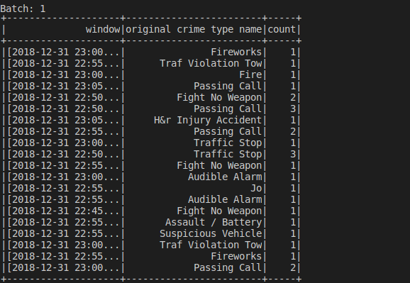

# SF Crime Statistics with Spark Streaming
## Project Overview
In this project, you will be provided with a real-world dataset, extracted from Kaggle, on San Francisco crime incidents, and you will provide statistical analyses of the data using Apache Spark Structured Streaming. You will draw on the skills and knowledge you've learned in this course to create a Kafka server to produce data, and ingest data through Spark Structured Streaming

## Development Environment
You may choose to create your project in the workspace we provide here, or if you wish to develop your project locally, you will need to set up your environment properly as described below:

Spark 2.4.3
Scala 2.11.x
Java 1.8.x
Kafka build with Scala 2.11.x
Python 3.6.x or 3.7.x
Environment Setup:
Download Spark from https://spark.apache.org/downloads.html. Choose "Prebuilt for Apache Hadoop 2.7 and later."
Unpack Spark in one of your folders (I usually put all my dev requirements in /home/users/user/dev).
Download Scala from the official site, or for Mac users, you can also use brew install scala, but make sure you download version 2.11.x.
Run below to verify correct versions:
```
java -version
scala -version
```
Make sure your ~/.bash_profile looks like below (might be different depending on your directory):
```
export SPARK_HOME=/Users/dev/spark-2.3.0-bin-hadoop2.7
export JAVA_HOME=/Library/Java/JavaVirtualMachines/jdk1.8.0_181.jdk/Contents/Home
export SCALA_HOME=/usr/local/scala/
export PATH=$JAVA_HOME/bin:$SPARK_HOME/bin:$SCALA_HOME/bin:$PATH
```

## Project Setup
- install pykafka for producer_server.py `conda install -c conda-forge pykafka` or `pip install kafka-python`

### Run the following in sequence to ensure the code works fine
- bin/zookeeper-server-start.sh config/zookeeper.properties
- bin/kafka-server-start.sh config/server.properties
- python producer_server.py
- bin/kafka-console-consumer.sh --bootstrap-server localhost:9092 --topic sfcalls --from-beginning
- spark-submit --packages org.apache.spark:spark-sql-kafka-0-10_2.11:2.3.0 --master local[4] data_stream.py 

We also need to write a consumer file to consume the data produced by the producer




